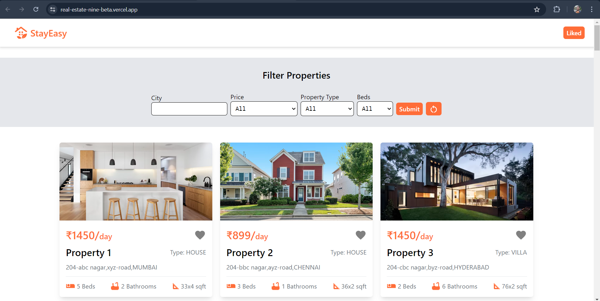
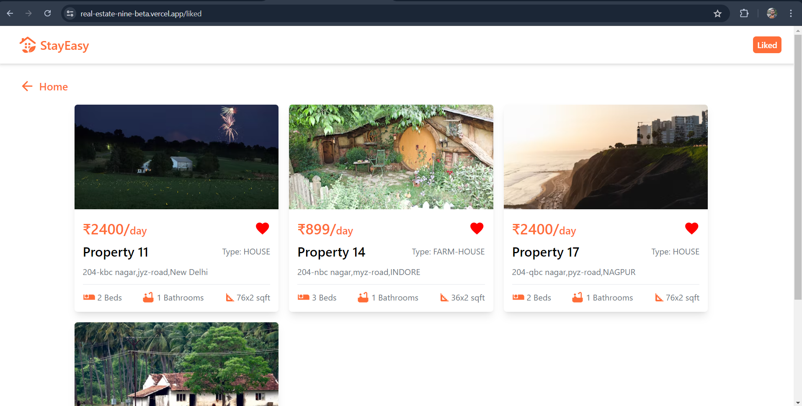

# Real Estate Website

## Task overview

The task was to create a simple real estate website which provides a listing of available properties.   The website should have filters based on categories such as city, price, property type and number of beds. User should also be able to add properties to favourites.

## Live Demo:

### [StayEasy](https://real-estate-nine-beta.vercel.app/)

## Functionalities:

- Listing of properties
- Filtering of properties based on different categories
- Adding properties to favourites

## Extra feature:

- Local storage implementation for liked properties

## Libraries and frameworks used:

- React JS
- Tailwind CSS
- mui
- react-router-dom

## Screenshots

### Home

## Liked Properties

## Learning from this project:

- Learned optimal use of react context api
- Learned efficient use of local storage
- Learned to utilize useParams hook of react-router-dom

## Future improvements

- Sort properties based on price, size etc.
- Integrate booking process and payment.
